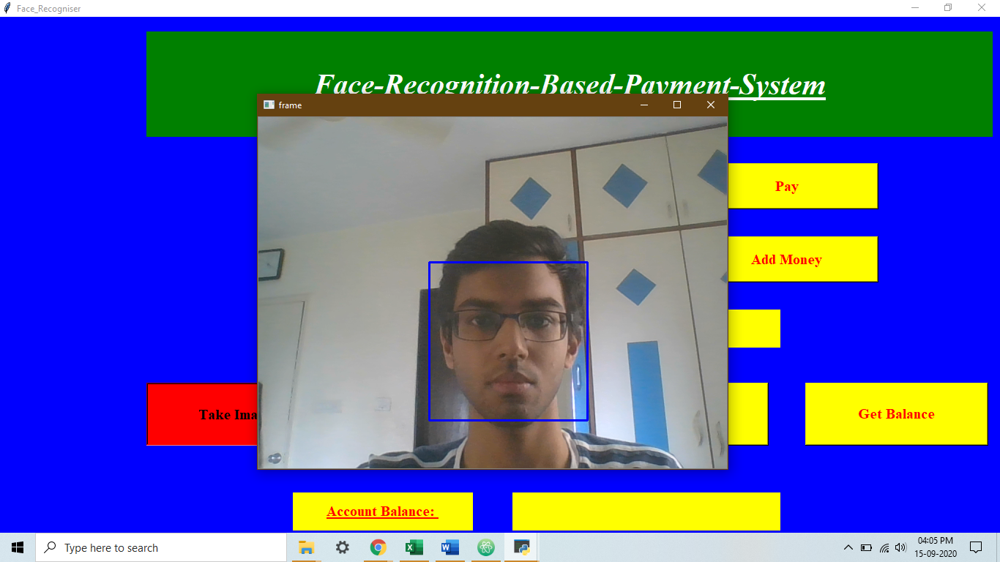
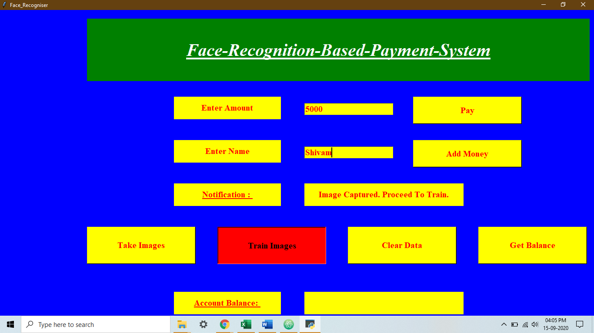
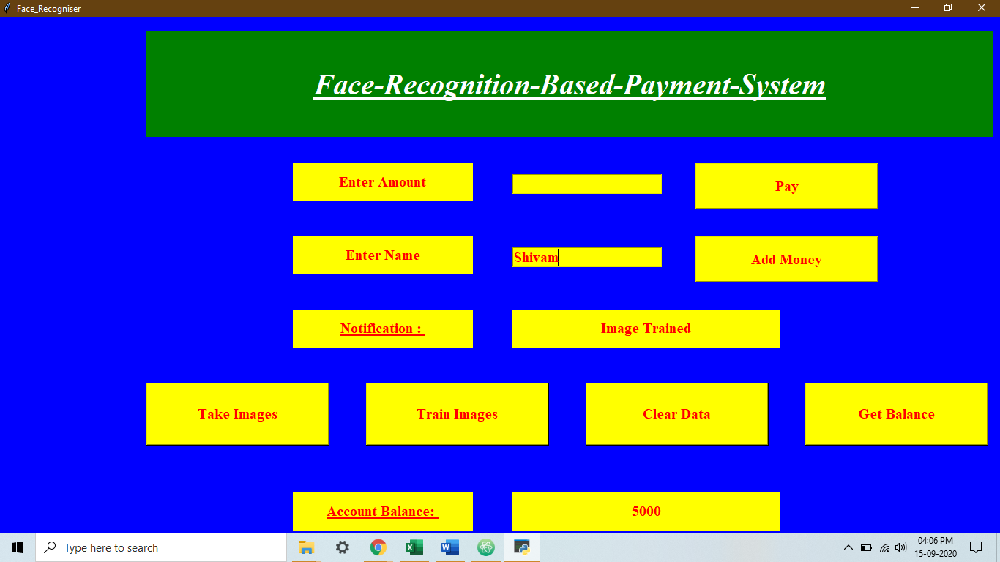
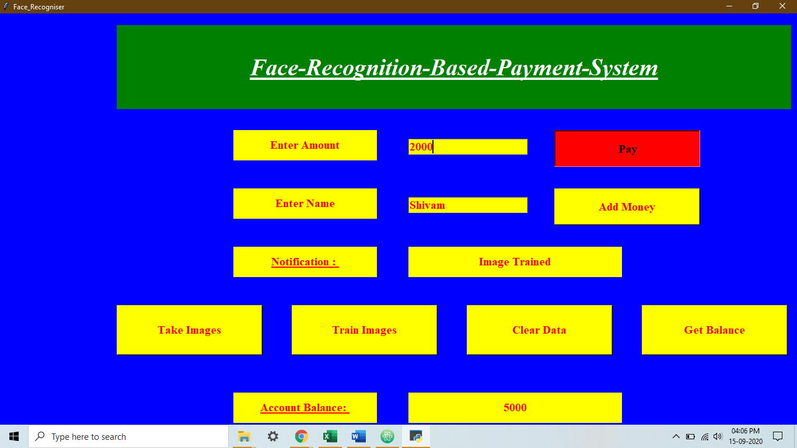
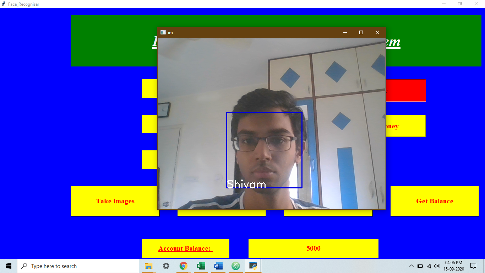

# Face-Recognition-Based-Payment-System-Using-OpenCV

## 1. Enter User Name and Initial Account Balance
This step creates the user's account on the database with Name and Initial Account Balance as user data.
The initial balance is entered as 5000 units in the below image.

 

## 2. Click 'Take Images' Which Starts the Camera and Captures Multiple Face Images
This step captures 60 images of the users face in less than 3 seconds.

 

## 3. Train the Images
Trains the images captured on the previous step with the LBPH Face Recognition Algorithm. 

 

## 4. Check User Account Balance by Typing In User Name and Then Click 'Get Balance'
This step demonstrates how to check user account balance. 

 

## 5. Type User Name and Amount to Pay/ Add to Account
This step demonstrates the process of carrying out a transaction.
The amount to be payed is 2000 units (debit from account) in the below image.

 

## 6. Camera Turns On and Checks If You Are The Same Person As Mentioned
The program tries to match your face as seen by the camera with the stored features of the name mentioned in the previous step.  

 

## 7. Check Account Balance to Confirm the Transaction Has Taken Place
If user's face matches the name mentioned, transaction takes place and can be verified by clicking on the 'Get Balance' button. 
We can see that the current account balance is now 3000 units. 

 

